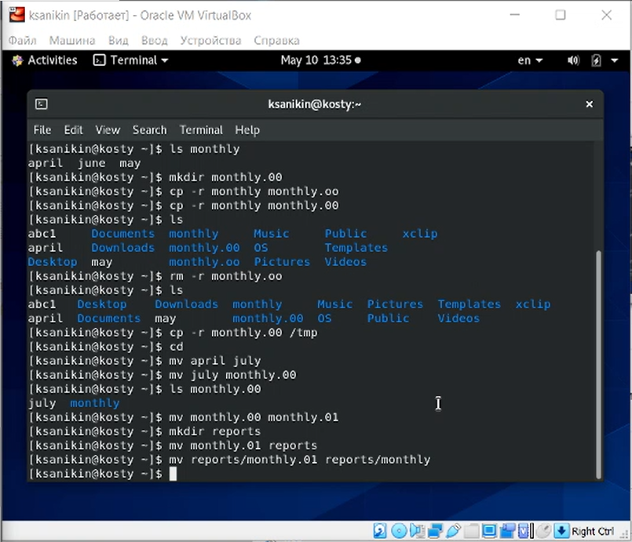
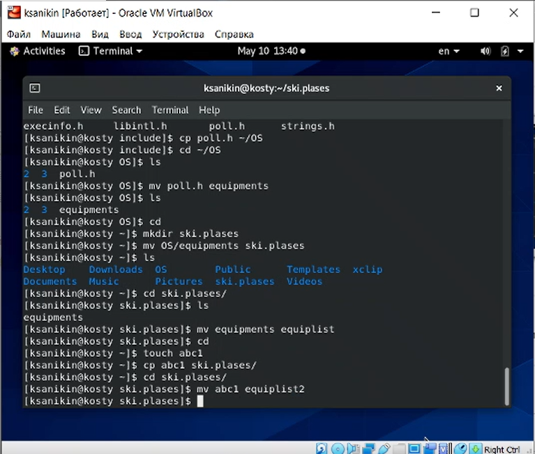
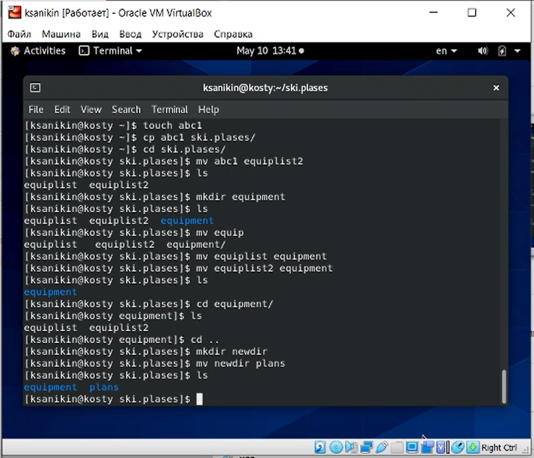

---
# Front matter
lang: ru-RU
title: Анализ файловой системы Linux и команды для работы с файлами и каталогами
subtitle: Лабораторная работа по ОС №6
author: Аникин Константин Сергеевич
group: НПИбд-01-20
---

# Цель работы

Ознакомление с файловой системой Linux, её структурой, именами и содержанием каталогов. 
Приобретение практических навыков по применению команд для работы с файлами и каталогами, 
по управлению процессами (и работами), по проверке использования диска 
и обслуживанию файловой системы.

# Задание

Выполнить задания лабораторной работы

# Выполнение лабораторной работы

## Задание 1

Я не буду вдаваться в подробности по каждой команде. Скажу лишь, что шел строго по примерам

Примеры пункта 3.2.2 (рис. 1)

*Рис. 1: Примеры пункта 3.2.2*

Примеры пункта 3.2.3 (рис. 2)

*Рис. 2: Примеры пункта 3.2.3*

Примеры пункта 3.2.4 (рис. 3)

*Рис. 3: Примеры пункта 3.2.4*

## Задание 2

2.1: cp poll.h ~ (в работе я скопировал файл в папку ~/OS и работал в ней)
	 mv poll.h equipments

(в дальнейшем предполагается, что работа идет в домашнем каталоге
Во время самой работы я работал из разных папок, но писать о переходе каждый раз не буду)

2.2: mkdir ski.plases

2.3: mv equipments ski.plases

2.4: mv equipments equiplist

2.5: touch abc1
	 cp abc1 ski.plases
	 mv ski.plases/abc1 ski.plases/equiplist2 (рис. 4)
	 

*Рис. 4: Пункты 2.1-2.5*

2.6: mkdir ski.plases/equipment

2.7: mv ski.plases/equiplist ski.plases/equipment
	 mv ski.plases/equiplist2 ski.plases/equipment
(передача двух файлов через запятую выдала ошибку, поэтому передал по одному)

2.8: mkdir newdir
	 mv newdir ski.plases
	 mv ski.plases/newdir ski.plases/plans (рис. 5)
	 

*Рис. 5: Пункты 2.6-2.8*

## Задание 3

3.1: 744

3.2: 711

3.3: 544

3.4: 664

## Задание 4

Согласно заданию, скриншоты не нужны, нужны только команды. 

Задания были выполнены, в чем можно убедиться, ознакомившись со скринкастом

4.1: Ладно, один скриншот будет. etc/password у меня нет, но есть etc/passwd (рис. 6)

*Рис. 6: Пункт 4.1*

Для остальных команд предполагается, что все необходимые файлы уже существуют.

Во время работы я создавал нужные файлы и папки. Скринкаст - доказательство.

4.2: cp feathers file.old

4.3: mv file.old play

4.4: cp play fun

4.5: mv fun play    mv play games

4.6: chmod u-r feathers

4.7: cat: feathers: Permission denied

4.8: cp: cannot open feathers for reading: Permission denied

4.9: chmod u+r feathers

4.10: chmod u-x play

4.11: bash: cd: play/: Permission denied

4.12: chmod u+x play

## Задание 5

mount: Показывает список подключенных устройств. Пример: mount (рис. 7)

*Рис. 7: man mount*

fsck: Восстанавливает файловую систему в случае её повреждения. Пример: fsck ext3 /dev/hdb1. Восстанавливает систему ext3 на жестком диске (рис. 8)

*Рис. 8: man fsck*

mkfs: Создает/меняет файловую систему устройства. Пример: mkfs -t ext2 /dev/hdb1. Меняет файловую систему жесткого диска на ext2 (рис. 9)

*Рис. 9: man mkfs*

kill: Прекращает процессы. Пример: kill -9 3827. Намертво убивает процесс 3827 (рис. 10)

*Рис. 10: man kill*

# Выводы

Материал был прочитан, задания были выполнены, 
немножко ненависти к происходящему было выплеснуто.
