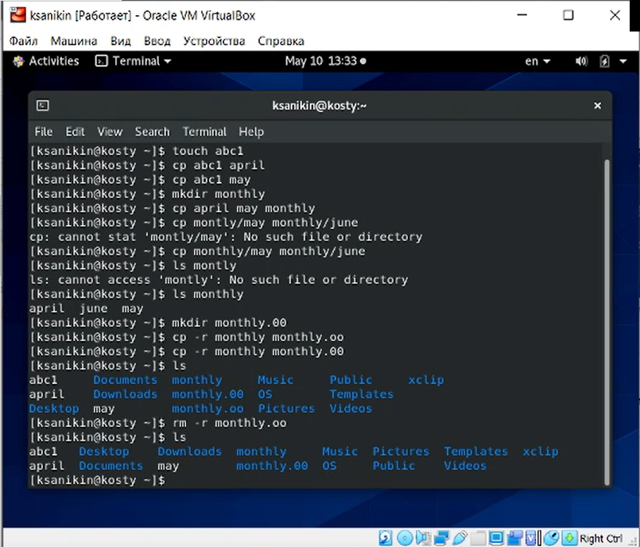
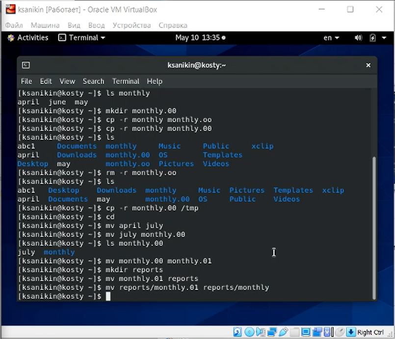
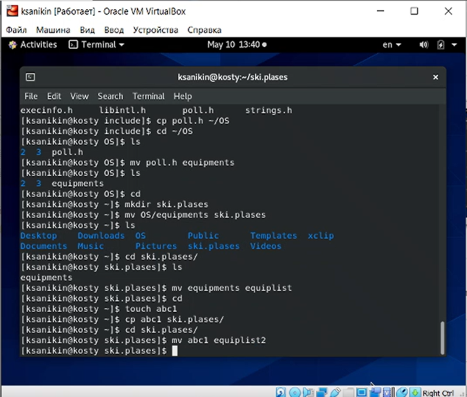

---
# Front matter
lang: ru-RU
title: Анализ файловой системы Linux и команды для работы с файлами и каталогами
subtitle: Лабораторная работа по ОС №6
author: Аникин Константин Сергеевич
group: НПИбд-01-20
---

# Цели

- Ознакомление с файловой системой Linux, её структурой, именами и содержанием каталогов. 

- Приобретение практических навыков по применению команд для работы с файлами и каталогами, по управлению процессами (и работами), 

по проверке использования диска и обслуживанию файловой системы.

---

# Задачи

- Выполнить задания в файле

- ААААААААААА

---

# Результаты 1

Были выполнены примеры в теоритической части

---

# Результаты 2

Затем было сделано задание 2

---

# Результаты 3

- Оставшиеся задания - теоритические, и могут быть проверены в отчете

---

# Вывод

- Работа проделана полностью

- Но зачем?
